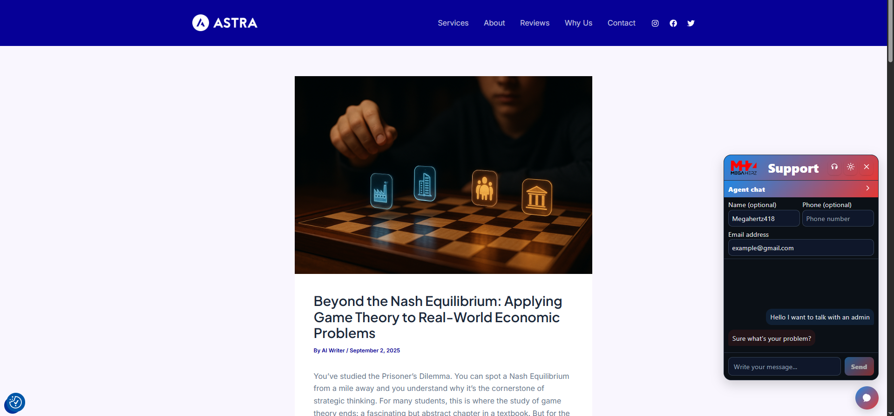

# Megachat Support (WordPress Plugin)

A **WordPress live support chat plugin** powered by **AI providers (OpenAI/Gemini)** and **Telegram integration**.  
The plugin keeps your existing site UI untouched and only adds the smart support and admin logging features.

## Features
- Live support chat with your existing site design
- Integrates with **OpenAI** or **Gemini**
- **Telegram bot** integration with secure Webhook
- Admin log panel with wide, clean UI
- Customizable branding (light/dark logo)
- Knowledge Base support via CSV

## Requirements
- WordPress >= 5.8  
- PHP >= 7.4 (tested with PHP 8.2)  
- PHP extensions: `cURL`, `JSON`  
- A Telegram bot created via [BotFather](https://t.me/botfather)

## Installation
1. Copy the `plugin/` folder into `wp-content/plugins/`.  
   Or download the `Megachat-support-X.X.X.zip` from [Releases](../../releases) and upload it in WordPress.  
2. Activate the plugin in the WordPress dashboard.  
3. Go to **Settings → Megachat Support** and fill in your configuration.

## Configuration

### 1. AI Provider Keys
- Select `openai` or `gemini` as the provider.  
- Enter your API key.  
- Keys are stored securely in WordPress Options (never commit them to the repo).

### 2. Knowledge Base (CSV)
- Create a Google Sheet, go to **File → Publish to web → CSV**.  
- Paste the CSV URL into the plugin settings.  
- Suggested column format:  
  | Question | Answer | Tags |

### 3. Telegram Webhook
- Enter and save your Bot Token.  
- The plugin will generate a JSON like this with your secret:
  {"url":"https://your-site.com/wp-json/support/v1/tg-webhook?secret=YOUR_SECRET"}

* Send it with a POST request to:
  https://api.telegram.org/bot<YOUR_BOT_TOKEN>/setWebhook

* After success, user messages will be forwarded to Telegram.

## Screenshots

**1. Chat Widget (frontend)**  

**2. Agent Chat (user → admin request)**  

**3. Telegram Bot Integration**  

**4. Admin Settings Panel**  

## Architecture

* **Frontend:** HTML, CSS, JS
* **Backend:** PHP (WordPress plugin + REST API)
* **Integrations:**

  * OpenAI/Gemini
  * Telegram Webhook

Data flow:
User ↔ Widget ↔ WP REST API ↔ LLM/Telegram ↔ Response

## FAQ

**Can I connect multiple Telegram bots?**
No. Each bot can only have one active Webhook, so practically one bot = one site.

**How is the Secret generated?**
It is generated and stored securely when you save plugin settings.

**Does the plugin store sensitive data?**
No. Only technical logs (status code, message, timestamp, debug info) are stored.

## Security & Privacy

* All HTML output is sanitized.
* Links use `rel="nofollow noopener noreferrer"`.
* Telegram Webhook requires a valid secret.
* Rate limiting is applied to prevent abuse.

## Releases

Get the latest release from [Releases](../../releases).

* Download the `.zip` file for easy WordPress install
* Or clone the source code and build it yourself

## Changelog

See [CHANGELOG.md](CHANGELOG.md) for version history.

## Contributing

Contributions are welcome!

* Guidelines: [CONTRIBUTING.md](CONTRIBUTING.md)
* Report vulnerabilities via: [SECURITY.md](SECURITY.md)

## License

This project is licensed under **GPL-2.0-or-later**.
See the [LICENSE](LICENSE) file for details.